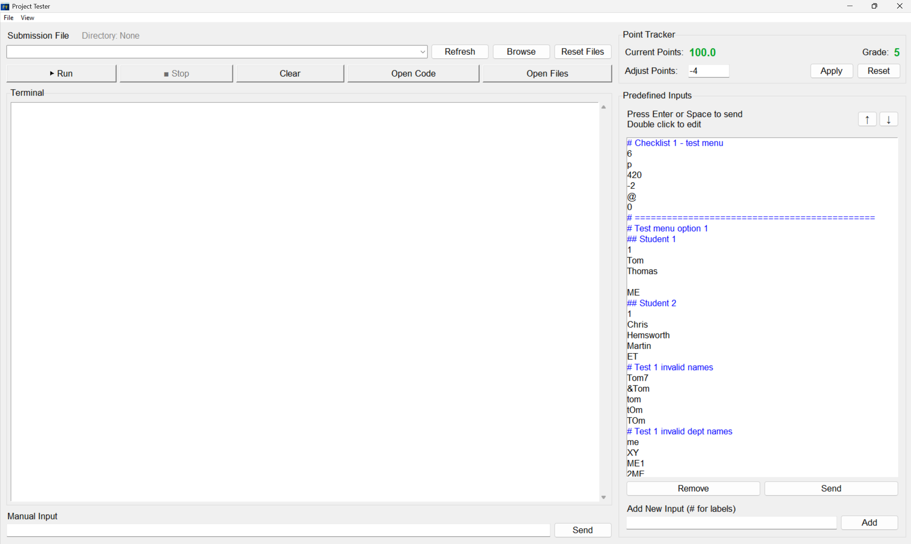
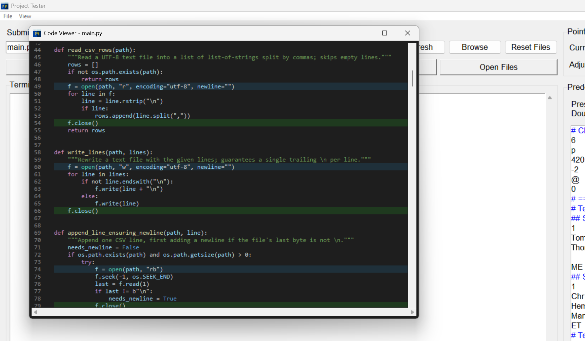
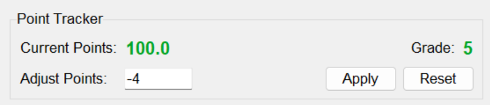
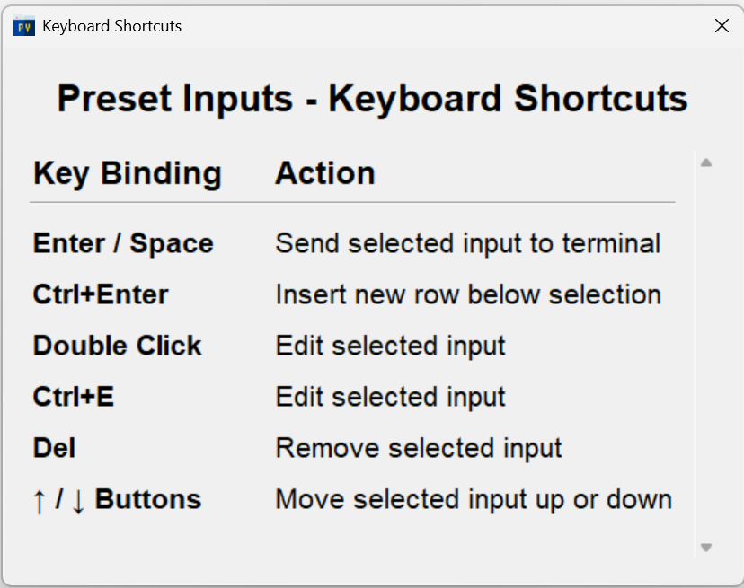
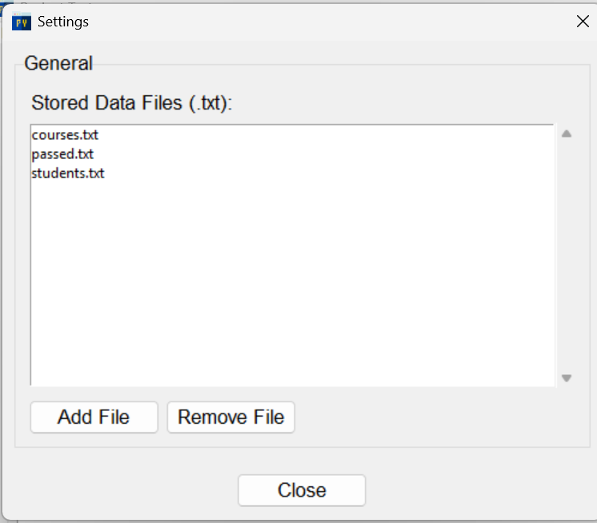
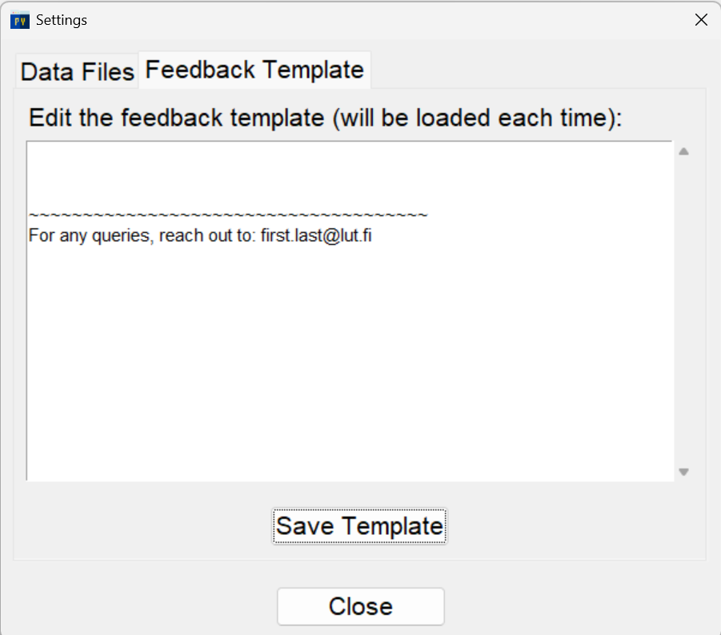

# Project Tester

A Python submission testing application with an integrated terminal, syntax highlighting, real-time file monitoring, and point tracking.


## Table of Contents

- [Features](#features)
- [Screenshots](#screenshots)
- [Installation](#installation)
- [Usage](#usage)
- [Building from Source](#building-from-source)
- [Project Structure](#project-structure)
- [Configuration](#configuration)
- [Keyboard Shortcuts](#keyboard-shortcuts)
- [Technical Details](#technical-details)
- [Contributing](#contributing)
- [License](#license)
- [Author](#author)

## Features

### Core Features
- **Integrated Terminal** - Run Python submissions with live output streaming
- **Predefined Inputs** - Store and send common test inputs with one click
- **Point Tracking System** - Automatic grading with configurable point adjustments (5/4/3/2/1/F scale)
- **Real-time File Monitoring** - Watch data files for changes using Watchdog
- **Syntax-Highlighted Code Viewer** - VS Code Dark+ theme with Pygments
- **CSV Data Viewer** - Rainbow-colored columns with collapsible sections

### UI Features
- **Zoom Control** - Scale entire UI from 0.5x to 3.0x (Ctrl+Scroll, Ctrl+±/0)
- **Inline Editing** - Double-click predefined inputs to edit
- **Context Menus** - Right-click for quick actions
- **Drag & Drop Reordering** - Organize predefined inputs with arrow buttons
- **Directory Management** - Browse and select submission directories
- **Settings Dialog** - Manage data template files

### Advanced Features
- **Multi-file Support** - Browse and test multiple Python files
- **Process Management** - Start, stop, and monitor running scripts
- **Configuration Persistence** - Saves zoom, directory, points, and preferences
- **Import/Export** - Share predefined inputs via JSON
- **Auto-scroll** - Terminal follows output automatically
- **Empty Input Support** - Send blank lines when needed

## Screenshots

### Main Interface
- Left panel: File selector, control buttons (Run/Stop/Clear/Open Code/Open Files), integrated terminal, manual input
- Right panel: Point tracker with grade display, predefined inputs sidebar with add/remove/reorder



### Code Viewer
- Highlights `.open()` and `.close()` functions and show their count
- Search functionality with next/previous match navigation
- Dark mode with VS Code theme
- Line numbers
- Python syntax highlighting



### Files Viewer
- Highlights any changes in the data
- Real-time CSV file monitoring
- Rainbow column colors
- Collapsible sections per file
- Live updates on file changes


## Installation

Currently, pre-built executables are available only for `Windows`. MacOS builds can be created from source or used from development. See [BUILD_INSTRUCTIONS_macOS.md](build_scripts/BUILD_INSTRUCTIONS_macOS.md) for details.

### Quick Start (Windows Executable)

1. **Download** the latest `Project Tester.exe` from releases
2. **Double-click** to run - that's it!
3. The app automatically creates `Documents\Project Tester\` folder with:
   - Default data files
   - Configuration file
   - Predefined inputs

**No Python installation required!**

### From Source (Development on Windows)

#### Prerequisites
- Python 3.13+ (or 3.10+)
- Windows 10/11 (64-bit)
- Git (optional)

#### Steps

1. **Clone the repository**
   ```bash
   git clone https://github.com/hamidurrk/python-project-tester-2025.git
   cd python-project-tester-2025
   ```

2. **Create virtual environment**
   ```powershell
   python -m venv .venv
   .\.venv\Scripts\Activate.ps1
   ```

3. **Install dependencies**
   ```powershell
   pip install -r requirements.txt
   ```

4. **Run the application**
   ```powershell
   python tester.py
   ```

## Usage

### Basic Workflow

1. **Browse** for a Python file to test (or select from dropdown)
2. **Add predefined inputs** for common test cases
3. **Click Run** to execute the script
4. **Send inputs** manually or from predefined list
5. **Track points** with automatic grade calculation
6. **View code** with syntax highlighting
7. **Monitor data files** in real-time

### Point Tracking

- Start with 100 points
- Adjust points with +/- values (default: -4)
- Automatic grade assignment:
  - **Grade 5**: 90-100 points (Green)
  - **Grade 4**: 80-89 points (Teal)
  - **Grade 3**: 70-79 points (Yellow/Amber)
  - **Grade 2**: 60-69 points (Orange)
  - **Grade 1**: 50-59 points (Red)
  - **Grade F**: 0-49 points (Purple)
- Points reset automatically when opening a new file
- Points persist across sessions for each file



### Predefined Inputs


- **Add**: Type input and click "Add" or press Enter
- **Send**: Select input and press Enter/Space or click "Send"
- **Edit**: Double-click to edit inline
- **Reorder**: Use ↑↓ buttons or context menu
- **Remove**: Select and click "Remove"
- **Labels**: Start with `#` for section headers (displayed in blue)
- **Import/Export**: File → Import/Export Predefined Inputs



### Data File Management

1. **Settings** → Manage stored data files
2. **Add File**: Select .txt files to use as templates
3. **Reset Files**: Copy templates to current directory
4. Files are stored in `data/` folder



5. **Feedback Template**: Use predefined templates for consistent feedback



## Building from Source

### Prerequisites

- Python 3.13+ with virtual environment
- PyInstaller (installed via pip)
- All project dependencies

### Build Steps

1. **Install PyInstaller** (if not already installed)
   ```powershell
   pip install pyinstaller pillow
   ```

2. **Run the build script**
   ```powershell
   .\build_scripts\build_exe.ps1
   ```

   Or manually:
   ```powershell
   python -m PyInstaller ProjectTester.spec --clean --onefile --add-data "assets/icon.png;assets" --add-data "data;data" --add-data "config.json;." --add-data "predefined_inputs.json;."
   ```

3. **Find the executable**
   ```
   dist\Project-Tester.exe
   ```

### Build Configuration

The build is configured in `ProjectTester.spec`:

```python
# Key settings:
- name: 'ProjectTester'
- console: False (GUI only, no console window)
- icon: 'assets/icon.png'
- version: 'version_info.txt' (Windows metadata)
- onefile: True (single executable)
- uac_admin: False (no admin rights required)

# Bundled resources:
- assets/icon.png
- data/ directory
- config.json
- predefined_inputs.json

# Hidden imports:
- pygments, watchdog (for syntax highlighting and file monitoring)
```

### Build Output

- **Executable size**: ~13 MB
- **Startup time**: 2-3 seconds
- **Memory usage**: ~50-100 MB
- **Platform**: Windows 10/11 (64-bit)

### Version Information

The executable includes proper Windows metadata:
- **Product Name**: Project Tester
- **Author**: Hamidur
- **Version**: 1.0.0.0
- **Description**: Project Tester - A Python submission testing application
- **Copyright**: © 2025 Hamidur. All rights reserved.

## Project Structure

```
python-project-tester-2025/
├── tester.py                      # Main application
├── config.json                    # Application configuration
├── predefined_inputs.json         # Saved predefined inputs
├── README.md                      # This file
├── .gitignore                     # Git ignore rules
├── assets/
│   └── icon.png                   # Application icon (256x256 PNG)
├── data/                          # Template data files
│   ├── students.txt               # Sample student data
│   ├── courses.txt                # Sample course data
│   └── passed.txt                 # Sample passed data
├── build_scripts/                 # Build automation and configuration
│   ├── build_exe.ps1              # PowerShell build script
│   ├── BUILD_INSTRUCTIONS.md      # Detailed build guide
│   ├── ProjectTester.spec         # PyInstaller configuration
│   └── version_info.txt           # Windows version metadata
├── .venv/                         # Virtual environment (not in repo)
├── build/                         # Build artifacts (not in repo)
├── dist/                          # Built executable (not in repo)
│   └── ProjectTester.exe
└── __pycache__/                   # Python cache (not in repo)
```

## Configuration

### Configuration Files

#### `config.json`
Stores application settings:
```json
{
  "zoom_level": 1.0,
  "submissions_dir": "C:\\path\\to\\submissions",
  "last_opened_file": "main.py",
  "current_points": 100,
  "last_file_for_points": "main.py"
}
```

#### `predefined_inputs.json`
Stores predefined inputs:
```json
[
  "# Test Menu",
  "1",
  "test_input",
  "420",
  ""
]
```

### Data Storage

**When running as executable:**
- All files stored in: `C:\Users\[Username]\Documents\Project Tester\`

**When running from source:**
- Files stored in project directory

### Customization

You can customize:
- **Grade scale**: Edit `GRADE_SCALE` dictionary in `tester.py`
- **Grade colors**: Edit `GRADE_COLORS` dictionary in `tester.py`
- **Default point adjustment**: Change default value in point tracker
- **Zoom range**: Modify `_zoom_in()` and `_zoom_out()` methods

## Keyboard Shortcuts

### Global
- `Ctrl + Scroll` - Zoom in/out
- `Ctrl + +` - Zoom in
- `Ctrl + -` - Zoom out
- `Ctrl + 0` - Reset zoom

### Predefined Inputs
- `Enter` - Send selected input
- `Space` - Send selected input
- `Ctrl + E` - Edit selected input
- `Double-click` - Edit inline
- `Right-click` - Context menu

### Manual Input
- `Enter` - Send input to process

### Inline Editing
- `Enter` - Save changes
- `Escape` - Cancel editing

## Technical Details

### Dependencies

```
tkinter         # GUI framework (built-in)
pygments        # Syntax highlighting
watchdog        # File system monitoring
pillow          # Image handling (for build only)
pyinstaller     # Executable creation (for build only)
```

### Architecture

- **GUI Framework**: tkinter/ttk
- **Process Management**: subprocess with threading
- **Output Handling**: Queue-based thread-safe streaming
- **Syntax Highlighting**: Pygments with VS Code Dark+ theme
- **File Monitoring**: Watchdog Observer pattern
- **Configuration**: JSON persistence

### Key Classes

- `PythonTesterApp` - Main application class
- `FileSystemEventHandler` - Real-time file monitoring (nested class)

### Threading Model

- **Main Thread**: GUI event loop
- **Output Thread**: Reads process stdout/stderr
- **Queue**: Thread-safe communication between threads

### Compatibility

- **Python**: 3.10, 3.11, 3.12, 3.13
- **Windows**: 10, 11 (64-bit)
- **Dependencies**: All cross-platform compatible

## Contributing

Contributions are welcome! Here's how:

1. **Fork** the repository
2. **Create** a feature branch (`git checkout -b feature/amazing-feature`)
3. **Commit** your changes (`git commit -m 'Add amazing feature'`)
4. **Push** to the branch (`git push origin feature/amazing-feature`)
5. **Open** a Pull Request

### Development Setup

```powershell
# Clone and setup
git clone https://github.com/hamidurrk/python-project-tester-2025.git
cd python-project-tester-2025
python -m venv .venv
.\.venv\Scripts\Activate.ps1
pip install -r requirements.txt

# Run tests (if available)
python -m pytest

# Run the app
python tester.py
```

### Code Style

- Follow PEP 8
- Use type hints
- Add docstrings for functions/classes
- Keep functions focused and modular

## License

This project is licensed under the MIT License - see below for details:

```
MIT License

Copyright (c) 2025 Md Hamidur Rahman Khan

Permission is hereby granted, free of charge, to any person obtaining a copy
of this software and associated documentation files (the "Software"), to deal
in the Software without restriction, including without limitation the rights
to use, copy, modify, merge, publish, distribute, sublicense, and/or sell
copies of the Software, and to permit persons to whom the Software is
furnished to do so, subject to the following conditions:

The above copyright notice and this permission notice shall be included in all
copies or substantial portions of the Software.

THE SOFTWARE IS PROVIDED "AS IS", WITHOUT WARRANTY OF ANY KIND, EXPRESS OR
IMPLIED, INCLUDING BUT NOT LIMITED TO THE WARRANTIES OF MERCHANTABILITY,
FITNESS FOR A PARTICULAR PURPOSE AND NONINFRINGEMENT. IN NO EVENT SHALL THE
AUTHORS OR COPYRIGHT HOLDERS BE LIABLE FOR ANY CLAIM, DAMAGES OR OTHER
LIABILITY, WHETHER IN AN ACTION OF CONTRACT, TORT OR OTHERWISE, ARISING FROM,
OUT OF OR IN CONNECTION WITH THE SOFTWARE OR THE USE OR OTHER DEALINGS IN THE
SOFTWARE.
```

## Author

**Hamidur**

- GitHub: [@hamidurrk](https://github.com/hamidurrk)
- Repository: [python-project-tester-2025](https://github.com/hamidurrk/python-project-tester-2025)

## Acknowledgments

- **Pygments** - Excellent syntax highlighting library
- **Watchdog** - Reliable file system monitoring
- **tkinter** - Python's built-in GUI toolkit
- **PyInstaller** - Easy executable creation
- **VS Code** - Inspiration for the Dark+ theme

## Known Issues

- Windows SmartScreen may show warning on first run (unsigned executable)
  - Click "More info" → "Run anyway"

## Support

For issues, questions, or suggestions:

1. **Issues**: [GitHub Issues](https://github.com/hamidurrk/python-project-tester-2025/issues)
2. **Discussions**: [GitHub Discussions](https://github.com/hamidurrk/python-project-tester-2025/discussions)

---

**Made with ❤️ by Hamidur**

If you find this project useful, please consider giving it a ⭐ on GitHub!
